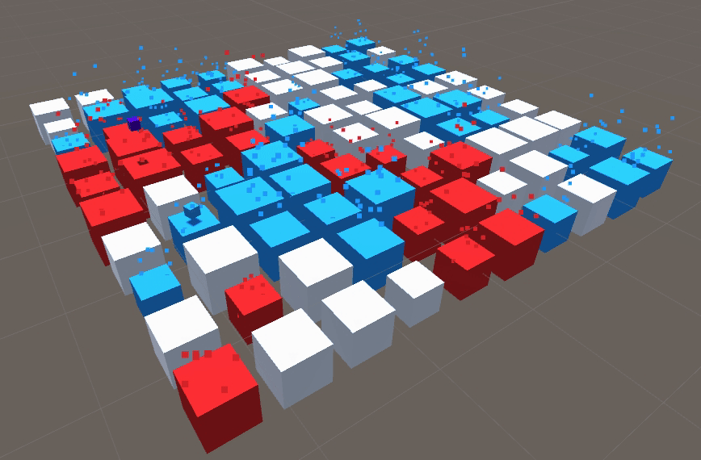

# Minery

    

## Concept

The board: a variety of blocks in 3d space, where blocks have gaps in between them to allow for fallthrough. Blocks vary in size, but the board is a square. The size of a block is related to its "production" which is a factor in resolving stalemates.

Play in 1st person, controlling a single cube player. Landing on a block will change it to your color.

When a neutral block is first changed to a color, it spawns a bot which is controlled by a script the player has uploaded previously (autonomously controlled similar to how [Halite](https://halite.io) is played).

Landing on a block of a different color changes it to your color, flipping the bot to be controlled by your script.

When a bot lands on a block, the block's ownership changes to that of the player (aka, if the bot changes colors, the blocks it landed on still belong to the previous owner).

The game is won if a player controls `(m - n + 1)` blocks, where `m` is the total number of blocks and `n` is the number of players on the board (2 or 4). _(This would mean that if all players are still alive, then each other player can only own 1 block!)_

If no player has won within the preallotted time limit (60, 120, or 180 seconds) then the player with the greatest production capability (the sum of the productive capabilities of owned blocks) wins.

Falling through the gaps or outside the game map is permitted. The blocks are simple accelerators, so touching the side of a block even at the very bottom will result in acceleration upwards (this can be used to touch a variety of blocks at once as you can keep tagging on your way up, but is very hard to control!). However, falling past the blocks and out of the map will destroy the respective bot/player.

If a player dies, all owned blocks will become neutral and all owned bots will be destroyed.

All bots/players are equipped with colliders, and colliding with another cube results in an inelastic collision (i.e. bots/players in collision will stick together).

